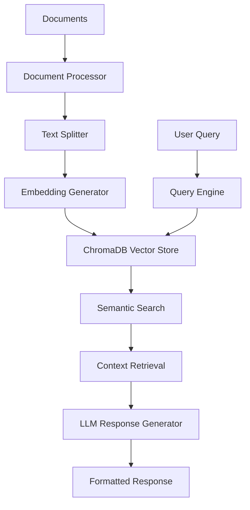

# Professional RAG Pipeline v2.2.0

A production-ready Retrieval-Augmented Generation (RAG) system with advanced document processing, intelligent search capabilities, and a modern web interface. Features centralized configuration management and comprehensive multilingual support.

## 🌟 Key Features

### Web Interface in Action
<div align="center">
  
  <p><i>RAG Pipeline searching through documents with real-time results</i></p>
</div>

### Core Capabilities
- **🎯 Centralized Configuration**: Single source of truth in `config.py` for all settings
- **📄 Multi-format Support**: PDF, DOCX, TXT, MD, HTML, XLSX, XLS, CSV
- **🌍 Multilingual**: Optimized for Turkish and English documents
- **🤖 Local LLM Integration**: Ollama integration with multiple model support
- **💾 Vector Database**: ChromaDB for efficient semantic search
- **🔍 Smart Search**: Advanced filtering by document, directory, or multiple files

### Advanced Features
- **📊 Intelligent Processing**
  - Smart chunking with overlap for context preservation
  - Table extraction from documents
  - OCR support for scanned documents
  - Automatic Table of Contents (ToC) filtering
  
- **🔄 Smart Updates**
  - Hash-based file change detection
  - Incremental database updates
  - Automatic handling of new, modified, and deleted files
  
- **🎨 Modern Web Interface**
  - Chainlit-based responsive UI
  - Real-time search with typing animations
  - Clickable file hyperlinks in sources
  - Comprehensive settings panel

## 📁 Project Structure

```
rag_pipeline/
├── config.py                  # 🎯 Centralized configuration management
├── document_processing.py     # 📄 Document processing and database operations
├── query_engine.py           # 🔍 Search and response generation (v2.2.0)
├── app.py                    # 🎨 Chainlit web interface (v1.2)
├── demo.py                   # 🚀 Interactive demonstration script
├── README.md                 # 📖 This file
└── requirements.txt          # 📦 Package dependencies
```

## 🚀 Quick Start

### Prerequisites
- Python 3.8+
- 8GB+ RAM
- 10GB+ free disk space
- CUDA-compatible GPU (optional, for acceleration)

### 1. Installation

```bash
# Clone the repository
git clone https://github.com/b2210765027/Ragsim.git
cd Ragsim

# Install dependencies
pip install -r requirements.txt

# For GPU acceleration (optional)
pip install onnxruntime-gpu
pip install tensorflow[and-cuda]
pip install torch torchvision torchaudio
```

### 2. Configuration

Edit `config.py` to customize your setup:

```python
class RAGPipelineConfig:
    # Set your document directory
    DATA_PATH = r"C:\path\to\your\documents"
    
    # Choose embedding model
    CURRENT_EMBEDDING_MODEL = EMBEDDING_MODELS["multilingual"]
    
    # Select LLM model
    CURRENT_LLM = LLM_MODELS["llama3.2"]
    
    # Adjust processing parameters
    CHUNK_SIZE = 800
    CHUNK_OVERLAP = 400
    DEFAULT_K = 8
```

### 3. System Setup

```python
from config import setup_rag_system, build_database, search

# One-time setup (installs Ollama and downloads models)
setup_rag_system()

# Build document database
build_database()

# Start searching!
search("What are the main requirements?")
```

### 4. Web Interface

Launch the interactive web interface:

```bash
chainlit run app.py
```

Then open http://localhost:8000 in your browser.

## 💻 Usage Examples

### Command Line Usage

```python
from config import search, search_multiple_docs, show_documents

# Basic search
search("radar specifications")

# Search in specific document
search("CMDS nedir?", document="karsi-tedbir-salma-sistemi-ktss.pdf")

# Search in directory
search("Akrep Radar Projesi Gözden geçirme ekibi kimdir", directory="C:\path\to\your\documents")

# Search multiple documents
search_multiple_docs("performance metrics", "report1.pdf", "report2.docx")

# View available documents
show_documents()
```

### Web Interface Features

1. **Search**: Natural language queries with instant results
2. **Settings Panel**: Adjust all parameters without code changes
3. **Database Management**: Update or rebuild database from UI
4. **Source Display**: Click on source links to open original documents

### Programmatic API

```python
from config import RAGPipeline

# Create pipeline instance
pipeline = RAGPipeline()

# Advanced search with custom parameters
pipeline.search("complex query", document="specific.pdf", k=10)

# Get database statistics
stats = pipeline.get_database_stats()
print(f"Total documents: {len(stats['files'])}")
print(f"Total chunks: {stats['total_chunks']}")

# Test filter configuration
pipeline.test_filter(document="test.pdf")
```

## 🔧 Configuration Options

### Embedding Models

| Model | Best For | Key Features |
|-------|----------|--------------|
| `multilingual` | Turkish + English docs | Best accuracy, slower |
| `english` | English-only docs | Faster processing |
| `turkish` | Turkish-only docs | Optimized for Turkish |
| `performance` | Turkish RAG tasks | Balance of speed/accuracy |

### LLM Models

| Model | Description | Use Case |
|-------|-------------|----------|
| `llama3.2` | Default model | General purpose |
| `qwen3` | Lightweight | Faster responses |
| `turkish_mistral` | Turkish-optimized | Turkish content |

### Processing Parameters

| Parameter | Default | Description |
|-----------|---------|-------------|
| `CHUNK_SIZE` | 800 | Characters per chunk |
| `CHUNK_OVERLAP` | 400 | Overlap between chunks |
| `DEFAULT_K` | 8 | Number of search results |
| `ENABLE_TOC_FILTERING` | True | Filter table of contents |
| `ENABLE_OCR` | False | Process scanned documents |
| `ENABLE_TABLE_EXTRACTION` | True | Extract tables from docs |

## 🎯 Best Practices

### Document Organization
```
documents/
├── specifications/
│   ├── technical_specs.pdf
│   └── requirements.docx
├── reports/
│   ├── test_results.pdf
│   └── analysis.xlsx
└── documentation/
    ├── user_manual.md
    └── api_guide.html
```

### Query Optimization
- ✅ **Good**: "What are the radar system's functional requirements?"
- ✅ **Good**: "List all test procedures for module X"
- ❌ **Avoid**: Single words like "test" or "data"
- ❌ **Avoid**: Overly broad queries like "tell me everything"

### Performance Tuning

**For Better Accuracy:**
```python
CHUNK_SIZE = 1200
CHUNK_OVERLAP = 600
DEFAULT_K = 10
```

**For Faster Processing:**
```python
CHUNK_SIZE = 500
CHUNK_OVERLAP = 200
ENABLE_OCR = False
EMBEDDING_DEVICE = 'cuda'  # If GPU available
```

## 🔍 Troubleshooting

### Common Issues

| Issue | Solution |
|-------|----------|
| No search results | Check `DATA_PATH` in config.py, verify files exist |
| Slow processing | Disable OCR, reduce chunk size, use GPU |
| Ollama connection error | Run `setup_rag_system()` to reinstall |
| Memory errors | Reduce `CHUNK_SIZE`, process fewer files at once |
| Web UI not loading | Check Chainlit installation, verify port 8000 is free |

### Validation Commands

```python
from config import validate_setup, show_config

# Check system health
validate_setup()

# View current configuration
show_config()

# Test database
from config import RAGPipeline
pipeline = RAGPipeline()
stats = pipeline.get_database_stats()
print(f"Database contains {stats['total_chunks']} chunks")
```

## 📊 System Architecture



## 🔄 Update & Maintenance

### Regular Updates
```python
# Daily/Weekly: Update with new documents
update_database()  # Smart incremental update
build_database()   # Initialize

# Monthly: Validate system
validate_setup()

# As needed: Check statistics
show_documents()
```

### Adding New Documents
1. Place documents in your `DATA_PATH` directory
2. Run `build_database()` - only new/modified files are processed
3. Start searching immediately

## 🚀 Demo Script

Try the interactive demo to explore all features:

```bash
# Full interactive demo
python demo.py

# Quick demo (no interaction)
python demo.py --quick

# Configuration demo
python demo.py --config
```

## 📈 Version History

### v2.2.0 (Current)
- Enhanced query engine with separate source/response returns
- Improved UI integration with better error handling
- Advanced source extraction for web interface

### v2.1.0
- Centralized configuration management
- Fixed all LangChain deprecation warnings
- Updated to latest package versions

### v2.0.0
- Complete architectural rewrite
- Advanced document processing with Docling
- Smart file change detection

## 🤝 Contributing

Contributions are welcome! Please:
1. Fork the repository
2. Create a feature branch
3. Follow the existing code structure
4. Add tests for new features
5. Submit a pull request

## 📝 License

MIT License - See LICENSE file for details

## 🙏 Acknowledgments

- Built with LangChain, ChromaDB, and Ollama
- UI powered by Chainlit
- Document processing via Docling

## 📞 Support

For issues or questions:
1. Check the [Troubleshooting](#-troubleshooting) section
2. Review `demo.py` for usage examples
3. Run `validate_setup()` to diagnose issues
4. Open an issue on GitHub
5. Send an e-mail : oguzturksaid@gmail.com

---

**Made with ❤️ by Mustafa Said Oğuztürk**

*For detailed technical documentation, see [TECHNICAL_DOCS.md](TECHNICAL_DOCS.md)*